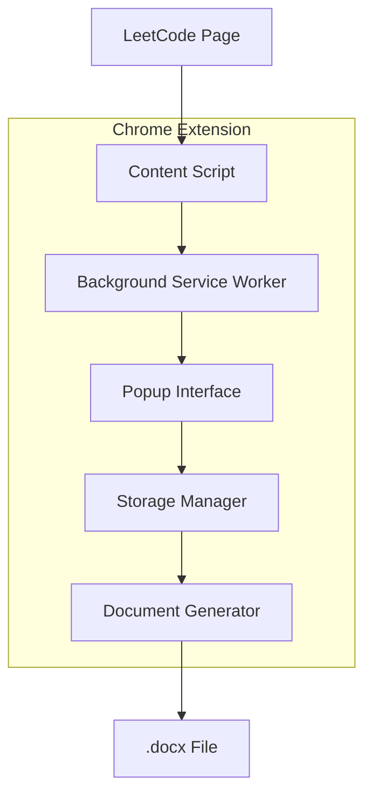

# LeetCode Documentation Generator

[](https://github.com/prithvi1236/leetcode-doc-generator)
[](LICENSE)
[](https://chrome.google.com/webstore)

A Chrome extension that automates the documentation of LeetCode problem solutions into professionally formatted .docx documents for academic submissions.

## 🚀 Quick Install

<div align="center">


*[Watch full tutorial on YouTube](https://www.youtube.com/watch?v=oswjtLwCUqg)*

</div>

1. Download [leetcode-doc-generator](https://github.com/prithvi1236/leetcode-doc-generator/archive/refs/heads/main.zip)
2. `chrome://extensions` → Developer mode → Load unpacked → Select folder leetcode-doc-generator-main
3. ✅ Done!

## 📋 Table of Contents

- [Features](#-features)
- [Architecture](#-architecture)
- [Installation](#-installation)
- [Usage](#-usage)
- [API Documentation](#-api-documentation)
- [Development](#-development)
- [Testing](#-testing)
- [Contributing](#-contributing)
- [Troubleshooting](#-troubleshooting)
- [License](#-license)

## ✨ Features

### Core Functionality
- ✅ **Smart Code Extraction**: Automatically capture LeetCode submission details from submission pages
- ✅ **Intelligent Line Number Removal**: Removes line numbers while preserving code indentation
- ✅ **HTML Element Filtering**: Ignores React syntax highlighter line number elements
- ✅ **Auto-Refresh**: Automatically refreshes page if content script isn't loaded
- ✅ **URL Redirection**: Handles `/submissions/detail/{id}/` URLs automatically

### User Experience
- ✅ **Keyboard Shortcut**: Quick capture with Ctrl+Shift+K - opens popup and auto-captures
- ✅ **Problem Management**: Full CRUD operations for problems and problem sets
- ✅ **Drag & Drop Reordering**: Intuitive problem reordering interface
- ✅ **Visual Feedback**: Real-time status updates with loading animations
- ✅ **Data Validation**: Comprehensive input validation and error handling

### Document Generation
- ✅ **Professional Formatting**: Generate beautifully formatted .docx documents
- ✅ **Multi-Language Support**: Smart language detection for various programming languages
- ✅ **Custom Styling**: Arial for text, Courier New for code, proper spacing and structure

## 🏗️ Architecture

### System Overview



### Component Architecture

| Component | Responsibility | Key Files |
|-----------|---------------|-----------|
| **Content Script** | DOM extraction, code cleaning | `content.js` |
| **Background Worker** | Message routing, lifecycle management | `background.js` |
| **Popup Interface** | User interaction, state management | `popup.js`, `popup.html`, `popup.css` |
| **Storage Manager** | Data persistence, CRUD operations | `storage.js` |
| **Document Generator** | .docx file creation and formatting | `docxGenerator.js` |

### Data Flow

1. **Extraction Phase**: Content script extracts code from LeetCode submission pages
2. **Processing Phase**: Background worker routes messages and manages state
3. **Storage Phase**: Storage manager persists data with validation
4. **Generation Phase**: Document generator creates formatted .docx files

## 📦 Installation

### Prerequisites
- Chrome browser (version 88+)
- Developer mode enabled in Chrome extensions
- Internet connection (for docx library CDN)

### Development Installation

```bash
# Clone the repository
git clone https://github.com/prithvi1236/leetcode-doc-generator.git
cd leetcode-doc-generator

# Load in Chrome
# 1. Open chrome://extensions/
# 2. Enable "Developer mode"
# 3. Click "Load unpacked"
# 4. Select the project directory
```

### Production Installation
1. Download from Chrome Web Store (coming soon)
2. Or use the manual installation method above

## 📖 Usage

### Basic Workflow

#### 1. Setup Problem Set
```javascript
// Navigate to extension popup
// Fill in required information
{
  "problemSetTitle": "Problem Set 6",
  "studentName": "John Doe"
}
```

#### 2. Capture Problems
- Navigate to LeetCode submission page
- Use keyboard shortcut `Ctrl+Shift+K` or click extension icon
- Click "Capture from Current Page"
- Extension automatically handles page refresh if needed

#### 3. Manage Problems
- **Reorder**: Drag and drop problems in desired sequence
- **Edit**: Modify problem details using edit button
- **Delete**: Remove individual problems or clear all

#### 4. Generate Document
- Click "Generate Document" to create .docx file
- File automatically downloads with format: `{Student Name} - {Problem Set Title}.docx`

### Advanced Features

#### Keyboard Shortcuts
- `Ctrl+Shift+K`: Open popup and auto-capture (if on submission page)

#### URL Handling
The extension automatically handles different LeetCode URL formats:
- `https://leetcode.com/problems/{slug}/submissions/{id}/` ✅ Direct support
- `https://leetcode.com/submissions/detail/{id}/` ✅ Auto-redirects to proper format

#### Error Recovery
- **Auto-refresh**: Automatically refreshes page if content script fails to load
- **Retry logic**: Multiple attempts with exponential backoff
- **Graceful degradation**: Clear error messages with recovery suggestions

## 📚 API Documentation

### Storage API

#### `saveProblemSetInfo(info)`
Saves problem set metadata.

**Parameters:**
- `info` (Object): Problem set information
  - `title` (string): Problem set title (2-200 characters)
  - `submittedBy` (string): Student name (2-100 characters)

**Returns:** `Promise<void>`

**Throws:** `Error` if validation fails

```javascript
await saveProblemSetInfo({
  title: "Problem Set 6",
  submittedBy: "John Doe"
});
```

#### `addProblem(problem)`
Adds a new problem to the current problem set.

**Parameters:**
- `problem` (Object): Problem data
  - `name` (string): Problem name (1-300 characters)
  - `submissionLink` (string): Valid LeetCode submission URL
  - `code` (string): Source code (1-100,000 characters)
  - `language` (string): Programming language

**Returns:** `Promise<void>`

```javascript
await addProblem({
  name: "Two Sum",
  submissionLink: "https://leetcode.com/problems/two-sum/submissions/123456/",
  code: "function twoSum(nums, target) { ... }",
  language: "JavaScript"
});
```

### Document Generation API

#### `generateDocxDocument(documentData)`
Generates a formatted .docx document.

**Parameters:**
- `documentData` (Object): Complete document data
  - `problemSetInfo` (Object): Problem set metadata
  - `problems` (Array): Array of problem objects

**Returns:** `Document` - docx Document instance

### Content Script API

#### `extractProblemData()`
Extracts problem data from current LeetCode submission page.

**Returns:** `Promise<Object>` - Extracted problem data

**Throws:** `Error` if extraction fails

## 🛠️ Development

### Project Structure

```
leetcode-doc-generator/
├── docs/                   # Documentation
│   ├── API.md             # API documentation
│   ├── ARCHITECTURE.md    # System architecture
│   └── CONTRIBUTING.md    # Contribution guidelines
├── src/                   # Source code (future organization)
├── tests/                 # Test files (future)
├── manifest.json          # Extension configuration
├── package.json           # Project metadata
├── popup.html            # Popup UI
├── popup.js              # Popup logic
├── popup.css             # Popup styling
├── content.js            # Content script
├── background.js         # Background service worker
├── docxGenerator.js      # Document generation
├── storage.js            # Storage operations
├── docx.min.js           # External library
└── icons/                # Extension icons
    ├── icon16.png
    ├── icon48.png
    ├── icon128.png
    └── bmc-brand-icon.png
```

### Development Setup

```bash
# Install development dependencies (if any)
npm install

# Enable Chrome extension developer mode
# Load unpacked extension from project directory

# For debugging
# Open Chrome DevTools on extension popup
# Check background page in chrome://extensions
```

### Code Style Guidelines

#### JavaScript
- Use ES6+ features where supported
- Prefer `async/await` over Promises
- Use descriptive variable and function names
- Add JSDoc comments for all functions
- Handle errors gracefully with try-catch blocks

#### HTML/CSS
- Use semantic HTML elements
- Follow BEM methodology for CSS classes
- Ensure responsive design principles
- Maintain accessibility standards

### Performance Considerations

- **Lazy Loading**: Content script only loads on LeetCode submission pages
- **Efficient DOM Queries**: Minimize DOM traversal operations
- **Memory Management**: Clean up event listeners and temporary data
- **Storage Optimization**: Use Chrome's local storage efficiently

## 🧪 Testing

### Manual Testing Checklist

#### Core Functionality
- [ ] Extension loads without errors
- [ ] Popup opens and displays correctly
- [ ] Problem set info saves and persists
- [ ] Code extraction works on various LeetCode pages
- [ ] Document generation produces valid .docx files

#### Edge Cases
- [ ] Handle pages without code blocks
- [ ] Handle malformed submission URLs
- [ ] Handle network connectivity issues
- [ ] Handle storage quota exceeded
- [ ] Handle very large code submissions

#### Browser Compatibility
- [ ] Chrome (latest)
- [ ] Chrome (version 88+)
- [ ] Different screen resolutions
- [ ] Different zoom levels

### Automated Testing (Future)

```bash
# Unit tests
npm test

# Integration tests
npm run test:integration

# E2E tests
npm run test:e2e
```

## 🤝 Contributing

### Getting Started

1. Fork the repository
2. Create a feature branch: `git checkout -b feature/amazing-feature`
3. Make your changes following the code style guidelines
4. Test your changes thoroughly
5. Commit with descriptive messages: `git commit -m 'Add amazing feature'`
6. Push to your branch: `git push origin feature/amazing-feature`
7. Open a Pull Request

### Development Workflow

1. **Issue Creation**: Create an issue describing the bug or feature
2. **Branch Creation**: Create a branch from `main` for your changes
3. **Development**: Implement changes following coding standards
4. **Testing**: Test changes manually and add automated tests if applicable
5. **Documentation**: Update documentation as needed
6. **Review**: Submit PR for code review
7. **Merge**: Merge after approval and testing

### Code Review Guidelines

- **Functionality**: Does the code work as intended?
- **Performance**: Are there any performance implications?
- **Security**: Are there any security vulnerabilities?
- **Maintainability**: Is the code readable and maintainable?
- **Testing**: Are there adequate tests for the changes?

## 🔧 Troubleshooting

### Common Issues

#### "Content script not loaded"
**Cause**: Content script failed to inject or page not fully loaded
**Solution**: Extension automatically refreshes page and retries

#### "Code extraction fails"
**Cause**: Page structure changed or submission not fully rendered
**Solutions**:
1. Ensure page is fully loaded before capture
2. Refresh the page manually
3. Check browser console for detailed error logs

#### "Document generation fails"
**Cause**: Invalid data or docx library not loaded
**Solutions**:
1. Verify all required fields are filled
2. Check internet connection (for docx library CDN)
3. Try refreshing the extension popup

#### "Storage quota exceeded"
**Cause**: Too much data stored locally
**Solution**: Clear old problem sets or reduce code size

### Debug Information

Enable debug logging by opening browser console:
1. Right-click extension popup → Inspect
2. Check Console tab for detailed logs
3. Background page logs: `chrome://extensions` → Background page

### Performance Issues

If the extension feels slow:
1. Check if you have too many problems stored
2. Verify internet connection for CDN resources
3. Close other Chrome extensions temporarily
4. Restart Chrome browser

## 📄 License

This project is licensed under the MIT License - see the [LICENSE](LICENSE) file for details.

## 🙏 Acknowledgments

- [docx library](https://github.com/dolanmiu/docx) for document generation
- [Font Awesome](https://fontawesome.com/) for icons
- LeetCode for providing the platform that inspired this tool

## 📞 Support

- 🐛 **Bug Reports**: [GitHub Issues](https://github.com/prithvi1236/leetcode-doc-generator/issues)
- 💡 **Feature Requests**: [GitHub Discussions](https://github.com/prithvi1236/leetcode-doc-generator/discussions)
- ☕ **Support Development**: [Buy me a coffee](https://buymeacoffee.com/prithvb)

---

<div align="center">
Made with ❤️ for students documenting their LeetCode journey
</div>