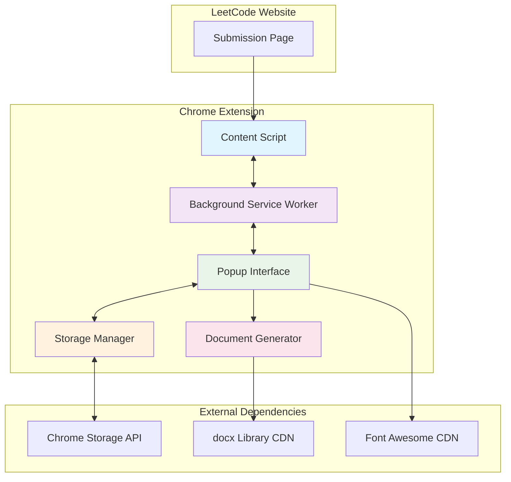
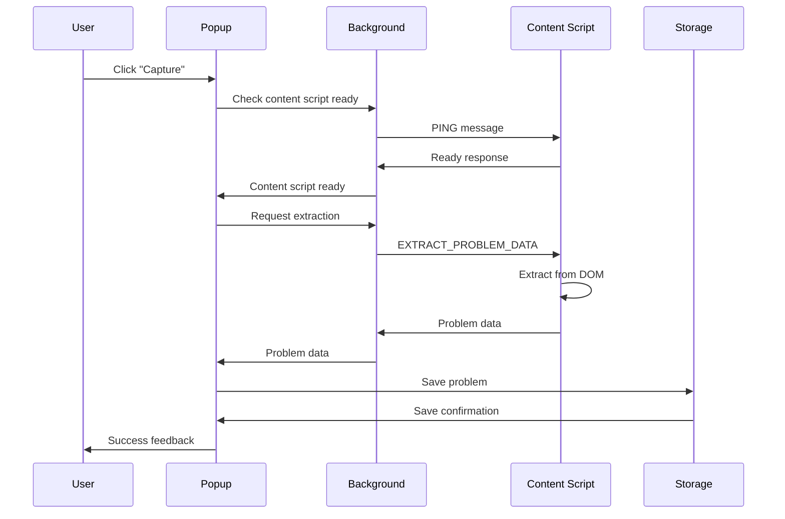
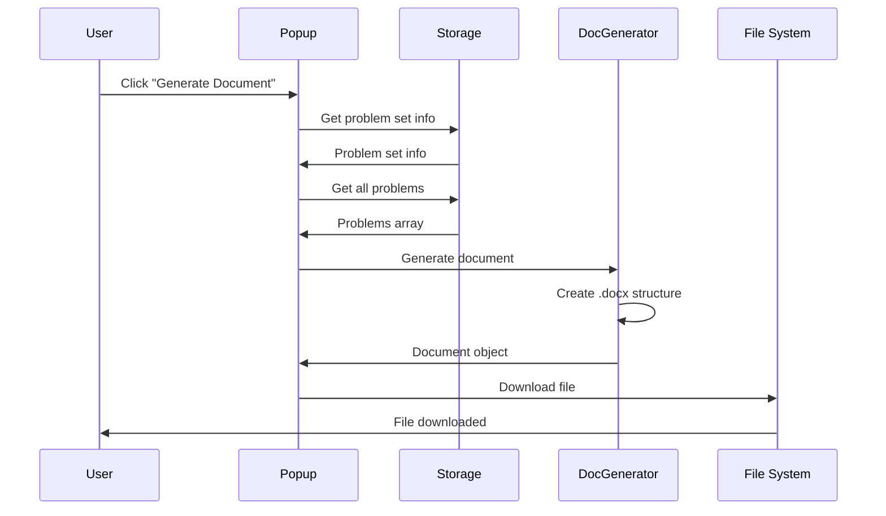
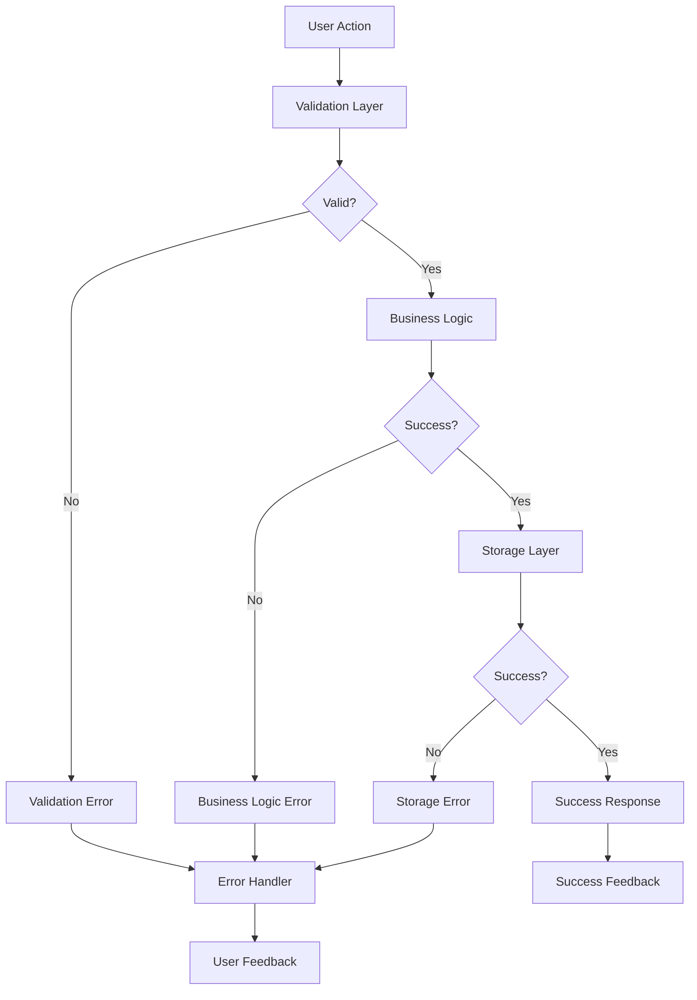

# Architecture Documentation

## System Architecture Overview

The LeetCode Documentation Generator follows a modular, event-driven architecture designed for Chrome Extension Manifest V3. The system is composed of five main components that communicate through well-defined interfaces.

## High-Level Architecture



## Component Details

### 1. Content Script (`content.js`)

**Purpose**: Extracts problem data from LeetCode submission pages

**Responsibilities**:
- DOM parsing and data extraction
- HTML element filtering (line numbers, decorative elements)
- Code cleaning and formatting
- URL format handling and redirection
- Communication with background script

**Key Features**:
- **Smart Extraction**: Handles multiple code block formats
- **Line Number Removal**: Preserves indentation while removing line numbers
- **HTML Filtering**: Removes React syntax highlighter elements
- **Auto-Redirect**: Converts `/submissions/detail/{id}/` to proper format
- **Error Recovery**: Graceful handling of extraction failures

**Architecture Pattern**: Observer Pattern
- Listens for messages from background script
- Responds with extracted data or error information

```javascript
// Message handling pattern
chrome.runtime.onMessage.addListener((message, sender, sendResponse) => {
  if (message.type === 'EXTRACT_PROBLEM_DATA') {
    extractProblemData()
      .then(data => sendResponse({ success: true, data }))
      .catch(error => sendResponse({ success: false, error: error.message }));
    return true; // Keep channel open for async response
  }
});
```

### 2. Background Service Worker (`background.js`)

**Purpose**: Central message router and lifecycle manager

**Responsibilities**:
- Message routing between content script and popup
- Extension lifecycle management
- Keyboard shortcut handling
- Temporary data storage for cross-component communication

**Architecture Pattern**: Mediator Pattern
- Acts as intermediary between all components
- Manages communication flow and state coordination

```javascript
// Message routing pattern
chrome.runtime.onMessage.addListener((message, sender, sendResponse) => {
  const isFromContentScript = sender.tab !== undefined;
  
  // Route based on message type and source
  if (message.type === 'PROBLEM_DATA_EXTRACTED' && isFromContentScript) {
    // Handle content script data
  }
  // ... other routing logic
});
```

### 3. Popup Interface (`popup.js`, `popup.html`, `popup.css`)

**Purpose**: User interface and interaction management

**Responsibilities**:
- User input handling and validation
- State management and UI updates
- Communication coordination with other components
- Visual feedback and error handling

**Architecture Pattern**: Model-View-Controller (MVC)
- **Model**: Data stored via Storage Manager
- **View**: HTML/CSS interface with dynamic updates
- **Controller**: Event handlers and business logic in popup.js

**Key Components**:
- **Problem Set Management**: CRUD operations for problem sets
- **Problem Management**: Individual problem operations
- **Document Generation**: Coordination of .docx creation
- **Auto-Refresh Logic**: Smart page refresh when content script unavailable

```javascript
// MVC pattern implementation
class PopupController {
  constructor() {
    this.model = new StorageManager();
    this.view = new PopupView();
    this.initializeEventListeners();
  }
  
  async handleCaptureButton() {
    // Controller logic coordinating model and view
  }
}
```

### 4. Storage Manager (`storage.js`)

**Purpose**: Data persistence and management

**Responsibilities**:
- Chrome storage API abstraction
- Data validation and sanitization
- CRUD operations for problems and problem sets
- Data integrity and consistency

**Architecture Pattern**: Repository Pattern
- Provides clean interface for data operations
- Abstracts storage implementation details
- Ensures data consistency and validation

**Data Structure**:
```javascript
{
  "currentProblemSet": {
    "info": {
      "title": "Problem Set 6",
      "submittedBy": "John Doe"
    },
    "problems": [
      {
        "id": "1234567890",
        "name": "Two Sum",
        "submissionLink": "https://...",
        "code": "function twoSum() {...}",
        "language": "JavaScript",
        "capturedAt": 1234567890,
        "order": 0
      }
    ]
  }
}
```

### 5. Document Generator (`docxGenerator.js`)

**Purpose**: .docx document creation and formatting

**Responsibilities**:
- Document structure creation
- Professional formatting application
- Code syntax highlighting and formatting
- File generation and download coordination

**Architecture Pattern**: Builder Pattern
- Constructs complex document objects step by step
- Separates document construction from representation

```javascript
// Builder pattern implementation
class DocumentBuilder {
  constructor(documentData) {
    this.sections = [];
    this.documentData = documentData;
  }
  
  addHeader() {
    this.sections.push(...createHeader(this.documentData.problemSetInfo));
    return this;
  }
  
  addProblems() {
    this.documentData.problems.forEach(problem => {
      this.sections.push(...createProblemSection(problem));
    });
    return this;
  }
  
  build() {
    return new Document({ sections: [{ children: this.sections }] });
  }
}
```

## Data Flow Architecture

### 1. Problem Capture Flow



### 2. Document Generation Flow



## Security Architecture

### Content Security Policy (CSP)
- **Script Sources**: Self and specific CDNs only
- **Style Sources**: Self and Font Awesome CDN
- **No Inline Scripts**: All JavaScript in separate files
- **No eval()**: Strict CSP prevents code injection

### Permission Model
- **Minimal Permissions**: Only required permissions requested
- **Host Permissions**: Limited to LeetCode domain
- **Storage Access**: Local storage only, no sync storage
- **Active Tab**: Required for page interaction and refresh

### Data Validation
- **Input Sanitization**: All user inputs validated and sanitized
- **URL Validation**: Submission links verified as LeetCode URLs
- **Size Limits**: Code size and text length limits enforced
- **Type Checking**: Runtime type validation for all data

## Performance Architecture

### Lazy Loading Strategy
- **Content Script**: Only loads on LeetCode submission pages
- **Popup Resources**: Loaded on-demand when popup opens
- **Document Generation**: Libraries loaded only when needed

### Memory Management
- **Event Listener Cleanup**: Proper cleanup of event listeners
- **Temporary Data**: Cleared after operations complete
- **DOM References**: Minimal DOM element caching
- **Storage Optimization**: Efficient data structures and cleanup

### Caching Strategy
- **Static Resources**: Browser caching for CSS/JS files
- **CDN Resources**: External libraries cached by browser
- **Storage Data**: Chrome storage provides built-in persistence
- **No Application Cache**: Relies on browser caching mechanisms

## Error Handling Architecture

### Error Propagation Strategy


### Error Recovery Mechanisms
- **Auto-Retry**: Automatic retry for transient failures
- **Graceful Degradation**: Fallback options when features fail
- **User Guidance**: Clear error messages with recovery steps
- **Logging**: Comprehensive error logging for debugging

## Scalability Considerations

### Current Limitations
- **Storage**: ~5MB Chrome local storage limit
- **Problems per Set**: Practically unlimited (storage permitting)
- **Code Size**: 100,000 characters per problem
- **Concurrent Operations**: Single-threaded JavaScript limitations

### Future Scalability Options
- **Cloud Storage**: Integration with cloud storage services
- **Compression**: Code compression for storage efficiency
- **Pagination**: UI pagination for large problem sets
- **Background Processing**: Web Workers for heavy operations

## Extension Lifecycle

### Installation Flow
1. **Extension Installation**: Manifest validation and permission grants
2. **Background Script Registration**: Service worker registration
3. **Content Script Injection**: Automatic injection on matching URLs
4. **Storage Initialization**: Default storage structure creation

### Runtime Flow
1. **User Navigation**: Content script injection on LeetCode pages
2. **User Interaction**: Popup activation and UI rendering
3. **Data Operations**: Storage operations and validation
4. **Document Generation**: On-demand document creation

### Update Flow
1. **Version Detection**: Background script detects updates
2. **Migration Logic**: Data migration if needed
3. **Feature Updates**: New functionality activation
4. **User Notification**: Update notification if significant changes

## Testing Architecture

### Unit Testing Strategy (Future)
- **Component Isolation**: Each component testable in isolation
- **Mock Dependencies**: External dependencies mocked for testing
- **Data Validation**: Comprehensive validation testing
- **Error Scenarios**: Error condition testing

### Integration Testing Strategy (Future)
- **Component Communication**: Message passing testing
- **Storage Operations**: End-to-end storage testing
- **Document Generation**: Complete document creation testing
- **User Workflows**: Full user journey testing

### Manual Testing Framework
- **Checklist-Based**: Systematic manual testing checklists
- **Cross-Browser**: Testing across supported browsers
- **Edge Cases**: Comprehensive edge case coverage
- **Performance**: Manual performance testing

## Deployment Architecture

### Development Environment
- **Local Development**: Direct extension loading in Chrome
- **Hot Reload**: Manual reload for development iterations
- **Debug Tools**: Chrome DevTools integration
- **Console Logging**: Comprehensive logging for debugging

### Production Environment
- **Chrome Web Store**: Official distribution channel
- **Version Management**: Semantic versioning strategy
- **Update Distribution**: Automatic updates via Chrome Web Store
- **Analytics**: Usage analytics through Chrome Web Store

This architecture provides a solid foundation for maintainability, scalability, and reliability while adhering to Chrome Extension best practices and security requirements.