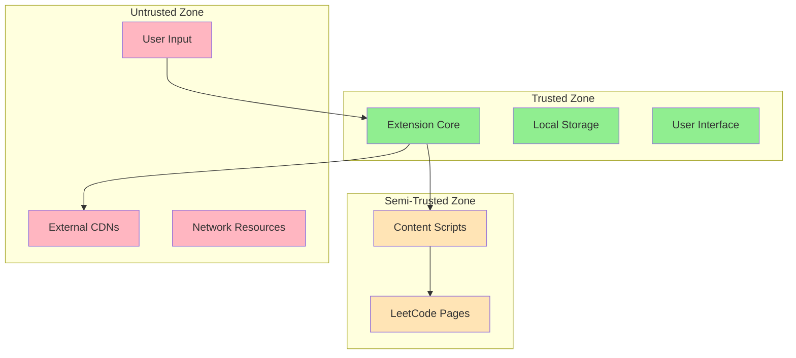

# Security Documentation

## Overview

This document outlines the security measures, best practices, and considerations implemented in the LeetCode Documentation Generator Chrome extension. Security is a critical aspect of browser extensions due to their privileged access to web pages and user data.

## Table of Contents

- [Security Architecture](#security-architecture)
- [Permission Model](#permission-model)
- [Data Security](#data-security)
- [Content Security Policy](#content-security-policy)
- [Input Validation](#input-validation)
- [Secure Coding Practices](#secure-coding-practices)
- [Vulnerability Assessment](#vulnerability-assessment)
- [Security Testing](#security-testing)
- [Incident Response](#incident-response)

## Security Architecture

### Threat Model

#### Assets to Protect
1. **User's LeetCode Submission Data**
   - Problem names and descriptions
   - Source code solutions
   - Submission URLs and metadata

2. **User's Personal Information**
   - Student names
   - Problem set titles
   - Academic work documentation

3. **Browser Security Context**
   - Extension permissions and capabilities
   - Access to LeetCode domain
   - Local storage data

#### Potential Threats
1. **Data Exfiltration**
   - Unauthorized transmission of user data
   - Malicious code injection
   - Third-party service compromise

2. **Code Injection Attacks**
   - Cross-Site Scripting (XSS)
   - Content Script injection
   - Malicious payload execution

3. **Permission Abuse**
   - Excessive permission usage
   - Unauthorized domain access
   - Storage manipulation

4. **Supply Chain Attacks**
   - Compromised dependencies
   - Malicious CDN resources
   - Build process compromise

### Security Boundaries



## Permission Model

### Minimal Permission Principle

The extension follows the principle of least privilege, requesting only essential permissions:

```json
{
  "permissions": [
    "storage",    // Required for data persistence
    "activeTab"   // Required for page interaction and refresh
  ],
  "host_permissions": [
    "https://leetcode.com/*"  // Limited to LeetCode domain only
  ]
}
```

### Permission Justification

#### `storage` Permission
- **Purpose**: Store problem sets and user preferences locally
- **Scope**: Chrome local storage only (no sync storage)
- **Data**: Problem metadata, code, and user-provided information
- **Security**: Data remains on user's device, no external transmission

#### `activeTab` Permission
- **Purpose**: Read LeetCode submission pages and refresh when needed
- **Scope**: Only active tab, only when user interacts with extension
- **Data**: DOM content from LeetCode submission pages
- **Security**: No persistent access, no background monitoring

#### `host_permissions` for LeetCode
- **Purpose**: Content script injection for data extraction
- **Scope**: Limited to `https://leetcode.com/*` domain only
- **Data**: Problem names, code, and submission metadata
- **Security**: HTTPS-only, specific domain restriction

### Permission Validation

```javascript
// Verify permissions at runtime
async function validatePermissions() {
  const requiredPermissions = ['storage', 'activeTab'];
  const hasPermissions = await chrome.permissions.contains({
    permissions: requiredPermissions,
    origins: ['https://leetcode.com/*']
  });
  
  if (!hasPermissions) {
    throw new Error('Required permissions not granted');
  }
}
```

## Data Security

### Data Classification

#### Sensitive Data
- **User's Source Code**: Intellectual property, academic work
- **Student Names**: Personal identifying information
- **Problem Set Titles**: Academic context information

#### Non-Sensitive Data
- **Problem Names**: Publicly available on LeetCode
- **Submission URLs**: Public LeetCode URLs
- **Programming Languages**: Public metadata

### Data Handling Principles

#### Data Minimization
- Collect only necessary data for functionality
- No tracking or analytics data collection
- No user behavior monitoring

#### Data Locality
- All data stored locally on user's device
- No data transmission to external servers
- No cloud storage or backup services

#### Data Retention
- Data persists until user explicitly deletes it
- No automatic data expiration
- User has full control over data lifecycle

### Storage Security

```javascript
// Secure storage implementation
class SecureStorage {
  static async saveData(key, data) {
    // Validate data before storage
    const validatedData = this.validateData(data);
    
    // Sanitize data to prevent injection
    const sanitizedData = this.sanitizeData(validatedData);
    
    // Store with error handling
    try {
      await chrome.storage.local.set({ [key]: sanitizedData });
    } catch (error) {
      console.error('Storage operation failed:', error);
      throw new Error('Failed to save data securely');
    }
  }
  
  static validateData(data) {
    // Implement comprehensive validation
    if (!data || typeof data !== 'object') {
      throw new Error('Invalid data format');
    }
    return data;
  }
  
  static sanitizeData(data) {
    // Remove potentially dangerous content
    // Escape HTML entities
    // Validate data types
    return data;
  }
}
```

## Content Security Policy

### CSP Implementation

The extension implements a strict Content Security Policy to prevent code injection:

```json
{
  "content_security_policy": {
    "extension_pages": "script-src 'self'; object-src 'self'; style-src 'self' 'unsafe-inline' https://cdnjs.cloudflare.com;"
  }
}
```

### CSP Rules Explanation

#### `script-src 'self'`
- **Purpose**: Only allow scripts from extension package
- **Security**: Prevents external script injection
- **Exception**: CDN scripts loaded via separate mechanism

#### `object-src 'self'`
- **Purpose**: Restrict object/embed sources
- **Security**: Prevents malicious plugin loading

#### `style-src 'self' 'unsafe-inline' https://cdnjs.cloudflare.com`
- **Purpose**: Allow extension styles and Font Awesome
- **Security**: Limited to trusted CDN for icons
- **Note**: `unsafe-inline` required for dynamic styling

### CSP Validation

```javascript
// Validate CSP compliance
function validateCSP() {
  // Check for inline scripts (should be none)
  const inlineScripts = document.querySelectorAll('script:not([src])');
  if (inlineScripts.length > 0) {
    console.warn('Inline scripts detected - CSP violation');
  }
  
  // Check for eval usage (should be none)
  const originalEval = window.eval;
  window.eval = function() {
    console.error('eval() usage detected - security violation');
    throw new Error('eval() is not allowed');
  };
}
```

## Input Validation

### Validation Strategy

All user inputs are validated at multiple layers:

1. **Client-Side Validation**: Immediate feedback and basic checks
2. **Business Logic Validation**: Comprehensive validation before processing
3. **Storage Validation**: Final validation before persistence

### Input Validation Implementation

```javascript
class InputValidator {
  static validateProblemSetInfo(info) {
    const errors = [];
    
    // Title validation
    if (!info.title || typeof info.title !== 'string') {
      errors.push('Title is required and must be a string');
    } else if (info.title.length < 2 || info.title.length > 200) {
      errors.push('Title must be between 2 and 200 characters');
    } else if (this.containsMaliciousContent(info.title)) {
      errors.push('Title contains invalid characters');
    }
    
    // Student name validation
    if (!info.submittedBy || typeof info.submittedBy !== 'string') {
      errors.push('Student name is required and must be a string');
    } else if (info.submittedBy.length < 2 || info.submittedBy.length > 100) {
      errors.push('Student name must be between 2 and 100 characters');
    } else if (this.containsMaliciousContent(info.submittedBy)) {
      errors.push('Student name contains invalid characters');
    }
    
    return {
      valid: errors.length === 0,
      errors: errors
    };
  }
  
  static validateProblemData(problem) {
    const errors = [];
    
    // Problem name validation
    if (!problem.name || typeof problem.name !== 'string') {
      errors.push('Problem name is required');
    } else if (problem.name.length > 300) {
      errors.push('Problem name too long');
    } else if (this.containsMaliciousContent(problem.name)) {
      errors.push('Problem name contains invalid characters');
    }
    
    // Code validation
    if (!problem.code || typeof problem.code !== 'string') {
      errors.push('Code is required');
    } else if (problem.code.length > 100000) {
      errors.push('Code exceeds maximum length');
    }
    
    // URL validation
    if (!problem.submissionLink || !this.isValidLeetCodeUrl(problem.submissionLink)) {
      errors.push('Invalid LeetCode submission URL');
    }
    
    return {
      valid: errors.length === 0,
      errors: errors
    };
  }
  
  static containsMaliciousContent(input) {
    // Check for potential XSS patterns
    const maliciousPatterns = [
      /<script/i,
      /javascript:/i,
      /on\w+\s*=/i,
      /<iframe/i,
      /<object/i,
      /<embed/i
    ];
    
    return maliciousPatterns.some(pattern => pattern.test(input));
  }
  
  static isValidLeetCodeUrl(url) {
    try {
      const urlObj = new URL(url);
      return urlObj.hostname === 'leetcode.com' && 
             urlObj.protocol === 'https:' &&
             (urlObj.pathname.includes('/submissions/') || 
              urlObj.pathname.includes('/problems/'));
    } catch {
      return false;
    }
  }
  
  static sanitizeHtml(input) {
    // Create a temporary element to leverage browser's HTML parsing
    const temp = document.createElement('div');
    temp.textContent = input;
    return temp.innerHTML;
  }
}
```

### XSS Prevention

```javascript
// Safe DOM manipulation
function safeSetTextContent(element, text) {
  // Always use textContent, never innerHTML for user data
  element.textContent = text;
}

function safeCreateElement(tag, text, className) {
  const element = document.createElement(tag);
  if (text) {
    element.textContent = text; // Safe text insertion
  }
  if (className) {
    element.className = className; // Safe class assignment
  }
  return element;
}

// Escape HTML entities
function escapeHtml(text) {
  const div = document.createElement('div');
  div.textContent = text;
  return div.innerHTML;
}
```

## Secure Coding Practices

### Code Security Guidelines

#### 1. No Dynamic Code Execution
```javascript
// ❌ Dangerous - Never use eval()
eval(userInput);

// ❌ Dangerous - Never use Function constructor
new Function(userInput)();

// ✅ Safe - Use proper parsing
JSON.parse(userInput);
```

#### 2. Safe DOM Manipulation
```javascript
// ❌ Dangerous - innerHTML with user data
element.innerHTML = userInput;

// ✅ Safe - textContent for user data
element.textContent = userInput;

// ✅ Safe - createElement for structure
const div = document.createElement('div');
div.textContent = userInput;
```

#### 3. Secure Event Handling
```javascript
// ✅ Safe - Proper event listener attachment
button.addEventListener('click', handleClick);

// ❌ Dangerous - Inline event handlers with user data
button.onclick = new Function(userInput);
```

#### 4. Safe URL Handling
```javascript
// ✅ Safe - URL validation
function isValidUrl(url) {
  try {
    const urlObj = new URL(url);
    return urlObj.protocol === 'https:' && 
           urlObj.hostname === 'leetcode.com';
  } catch {
    return false;
  }
}
```

### Error Handling Security

```javascript
// Secure error handling - don't expose sensitive information
function handleError(error, context) {
  // Log detailed error for debugging (not visible to user)
  console.error(`Error in ${context}:`, error);
  
  // Show generic error to user
  const userMessage = 'An error occurred. Please try again.';
  showUserMessage(userMessage, 'error');
  
  // Don't expose stack traces or internal details
  return {
    success: false,
    message: userMessage
  };
}
```

## Vulnerability Assessment

### Common Extension Vulnerabilities

#### 1. Cross-Site Scripting (XSS)
- **Risk**: Malicious script injection through user input
- **Mitigation**: Input validation, output encoding, CSP
- **Testing**: Inject XSS payloads in all input fields

#### 2. Content Script Injection
- **Risk**: Malicious content scripts on compromised pages
- **Mitigation**: Strict CSP, input validation, secure messaging
- **Testing**: Test on pages with malicious scripts

#### 3. Permission Escalation
- **Risk**: Abuse of granted permissions
- **Mitigation**: Minimal permissions, runtime validation
- **Testing**: Verify permission usage is justified

#### 4. Data Exfiltration
- **Risk**: Unauthorized data transmission
- **Mitigation**: No external network requests, local storage only
- **Testing**: Monitor network traffic during operation

### Security Checklist

#### Code Review Security Checklist
- [ ] No use of `eval()` or `Function()` constructor
- [ ] No `innerHTML` with user data
- [ ] All user inputs are validated and sanitized
- [ ] No hardcoded secrets or credentials
- [ ] Proper error handling without information disclosure
- [ ] CSP compliance verified
- [ ] Minimal permission usage
- [ ] No external data transmission

#### Runtime Security Checklist
- [ ] Extension loads without CSP violations
- [ ] All network requests are to approved domains
- [ ] User data is properly sanitized before display
- [ ] No JavaScript errors that could indicate injection
- [ ] Storage operations are secure and validated

## Security Testing

### Automated Security Testing

```javascript
// Security test suite
describe('Security Tests', () => {
  describe('Input Validation', () => {
    it('should reject XSS payloads', () => {
      const xssPayloads = [
        '<script>alert("xss")</script>',
        'javascript:alert("xss")',
        '',
        '<iframe src="javascript:alert(\'xss\')"></iframe>'
      ];
      
      xssPayloads.forEach(payload => {
        expect(() => validateInput(payload)).toThrow();
      });
    });
    
    it('should sanitize HTML content', () => {
      const maliciousHtml = '<script>alert("xss")</script>Hello';
      const sanitized = sanitizeHtml(maliciousHtml);
      expect(sanitized).not.toContain('<script>');
      expect(sanitized).toContain('Hello');
    });
  });
  
  describe('URL Validation', () => {
    it('should only allow LeetCode URLs', () => {
      const validUrl = 'https://leetcode.com/problems/two-sum/submissions/123/';
      const invalidUrl = 'https://malicious.com/fake-leetcode';
      
      expect(isValidLeetCodeUrl(validUrl)).toBe(true);
      expect(isValidLeetCodeUrl(invalidUrl)).toBe(false);
    });
  });
});
```

### Manual Security Testing

#### Penetration Testing Checklist
- [ ] **Input Fuzzing**: Test with malformed, oversized, and malicious inputs
- [ ] **XSS Testing**: Inject XSS payloads in all input fields
- [ ] **URL Manipulation**: Test with malicious URLs and redirects
- [ ] **Storage Testing**: Verify data integrity and access controls
- [ ] **Permission Testing**: Verify minimal permission usage
- [ ] **Network Testing**: Monitor for unauthorized network requests

#### Security Test Cases

```javascript
// Test case examples
const securityTestCases = {
  xssPayloads: [
    '<script>alert("xss")</script>',
    'javascript:alert("xss")',
    '',
    '<svg onload=alert("xss")>',
    '<iframe src="javascript:alert(\'xss\')"></iframe>',
    '"><script>alert("xss")</script>',
    '\';alert("xss");//'
  ],
  
  maliciousUrls: [
    'javascript:alert("xss")',
    'data:text/html,<script>alert("xss")</script>',
    'https://malicious.com/fake-leetcode',
    'http://leetcode.com/', // HTTP instead of HTTPS
    'https://leetcode.evil.com/',
    'https://evil.com/leetcode.com/'
  ],
  
  oversizedInputs: {
    title: 'A'.repeat(1000),
    code: 'A'.repeat(200000),
    name: 'B'.repeat(500)
  }
};
```

## Incident Response

### Security Incident Classification

#### Severity Levels
- **Critical**: Data breach, code execution, permission escalation
- **High**: XSS vulnerability, unauthorized access
- **Medium**: Input validation bypass, information disclosure
- **Low**: Minor security configuration issues

### Incident Response Process

#### 1. Detection and Analysis
- Monitor for security-related errors or anomalies
- Analyze reported security issues
- Assess impact and severity

#### 2. Containment
- Disable affected functionality if necessary
- Prevent further exploitation
- Preserve evidence for analysis

#### 3. Eradication and Recovery
- Fix underlying vulnerability
- Test fix thoroughly
- Deploy updated version

#### 4. Post-Incident Activities
- Document lessons learned
- Update security measures
- Improve detection capabilities

### Security Contact

For security-related issues:
- **Email**: Create security@leetcode-doc-generator.com
- **GitHub**: Use private security advisory
- **Response Time**: 24-48 hours for critical issues

### Responsible Disclosure

We encourage responsible disclosure of security vulnerabilities:

1. **Report privately** through appropriate channels
2. **Allow reasonable time** for fix development
3. **Coordinate disclosure** timing with maintainers
4. **Provide clear details** about the vulnerability

## Security Maintenance

### Regular Security Activities

#### Monthly
- [ ] Review and update dependencies
- [ ] Check for new security advisories
- [ ] Review access logs and error reports

#### Quarterly
- [ ] Conduct security code review
- [ ] Update threat model
- [ ] Review and test incident response procedures

#### Annually
- [ ] Comprehensive security audit
- [ ] Penetration testing
- [ ] Security training for contributors

### Security Monitoring

```javascript
// Security monitoring implementation
class SecurityMonitor {
  static logSecurityEvent(event, severity, details) {
    const logEntry = {
      timestamp: new Date().toISOString(),
      event: event,
      severity: severity,
      details: details,
      userAgent: navigator.userAgent,
      url: window.location.href
    };
    
    console.warn('Security Event:', logEntry);
    
    // In production, send to security monitoring service
    // this.sendToSecurityService(logEntry);
  }
  
  static detectAnomalousActivity() {
    // Monitor for unusual patterns
    // - Rapid successive operations
    // - Large data operations
    // - Unusual error patterns
  }
}
```

This security documentation provides a comprehensive framework for maintaining the security posture of the LeetCode Documentation Generator extension throughout its lifecycle.